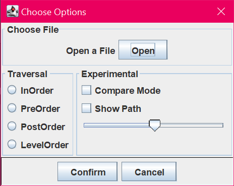
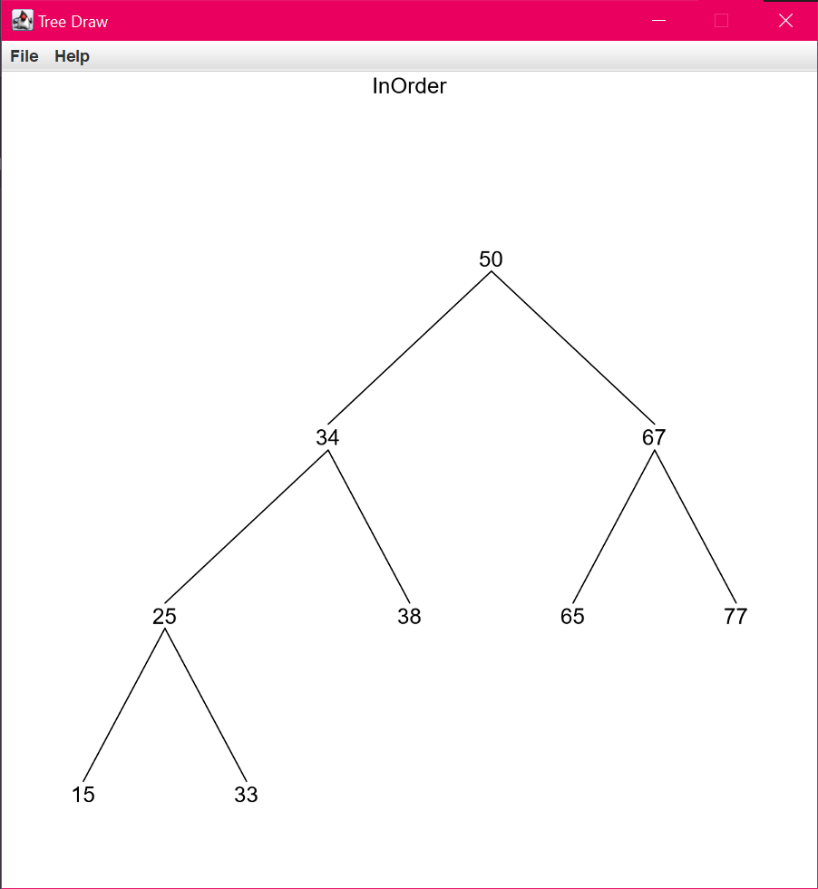
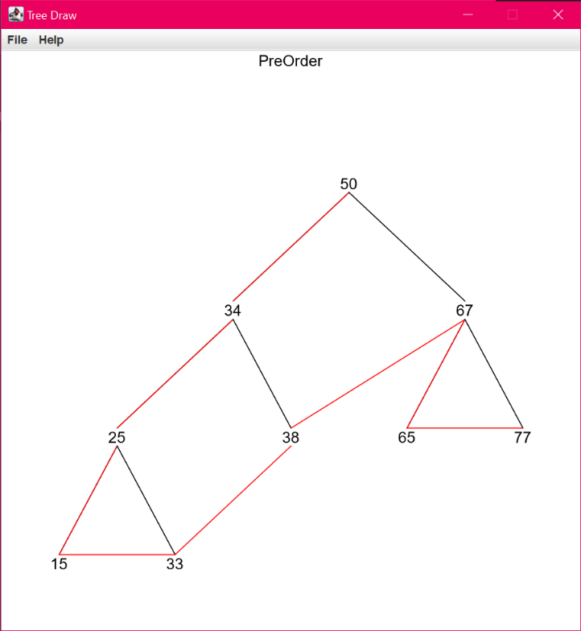
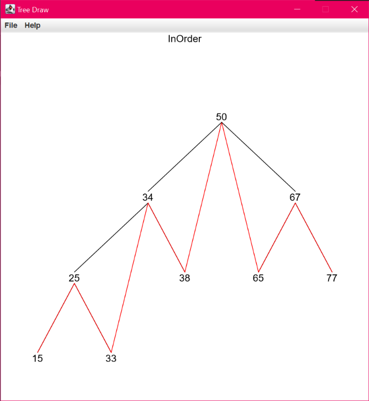
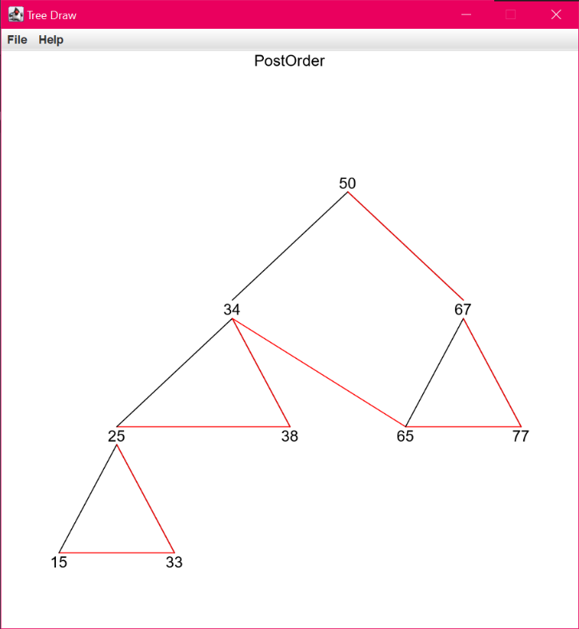
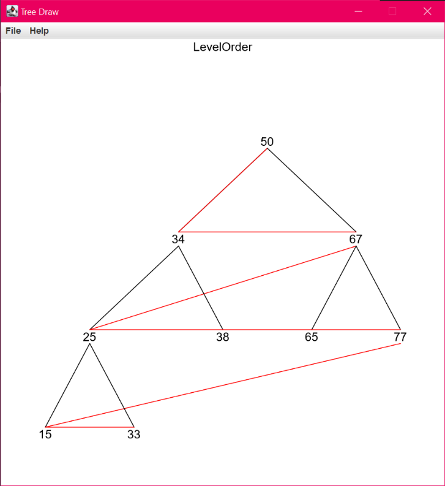
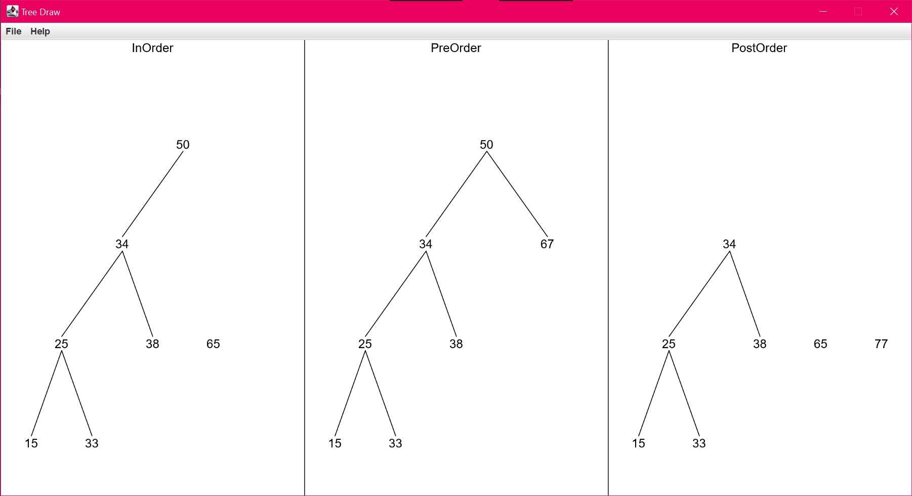

[](https://github.com/avinal/Binary-Search-Tree-Traversal/actions)
# Binary-Search-Tree-Traversal
Binary Search Tree Creation and Traversal Visualization from given node points using Drawing Algorithm in Java

This mini-project was developed for the partial fulfilment of the  2nd year, 4th semester  of Bachelor of Technology in 
*Data Structures : CSD-223* by following students:-
* [Avinal Kumar](https://github.com/avinal)
* [Harsimranjeet Singh Saini](https://github.com/harry-stark)
* [Pooja Nehra](https://github.com/pooja5101)

## Project Resources
1. [The Project Proposal](https://github.com/avinal/Binary-Search-Tree-Traversal/blob/master/project-resource/DS_Project_Proposal.pdf)
2. [The Project Report](https://github.com/avinal/Binary-Search-Tree-Traversal/blob/master/project-resource/DS_Project_Report.pdf)

## Get Started with the project
1. Requirements 
    * Java must be installed
    * Gradle to build the project/ Can be build without that too
    * Use IntelliJ IDEA to get started quickly
2. Try the project without building - Find the latest release in the release section download jar file or the executable.
    * For jar run `java -jar Binary-Search-Tree.Traversal.main.jar` in terminal or command prompt.
    * Provide a text file containing numbers(An example is given in the repo).
3. To build this project, clone this repo first.
```shell script
  git clone https://github.com/avinal/Binary-Search-Tree-Traversal
```
4. If you have IntelliJ IDEA installed just open the project and build it the regular way.
5. Or you may use gradle to build the project
```shell script
  cd Binary-Search-Tree-Traversal
  ./gradlew build
```
6. Run the project
```shell script
  cd build/classes/java/main
  java Main.class
```

## HighLights of the project
1. When launched first time the selection menu appears.

    
    
    * Traversal Options 
        * InOrder : Root-Right-Left
        * PreOrder : Right-Root-Left
        * PostOrder : Right-Left-Root
        * LevelOrder : Breadth-First-Traversal
    * Choose File - Choose the text file.
    * Experimental Features
        * Compare Mode - Draw three DFS simultaneously
        * Show Path - Draw the path of traversal
        * Speed Selector - 0.5 second/node to 1.5 second/node
2. Choose any options from **Traversal** pane and **Choose a File**. Given below is an example for sequence
 50 34 67 25 38 65 77 15 33.
 
    
    
3. If we choose **Show Path** feature. Then the different traversals will show as below.
    * Preorder with Show Path
    
    
    
    * Inorder with Show Path
    
    
    
    * Postorder with Show Path
    
    
    
    * Levelorder with Show Path 
    
    
    
4. If **Compare Mode** is activated then the following figure as snapshot occurs.
    
    
    
    The compare mode was developed using multithreading. 
 
5. Additionally you can set speed by using the slider.
    


 

 
